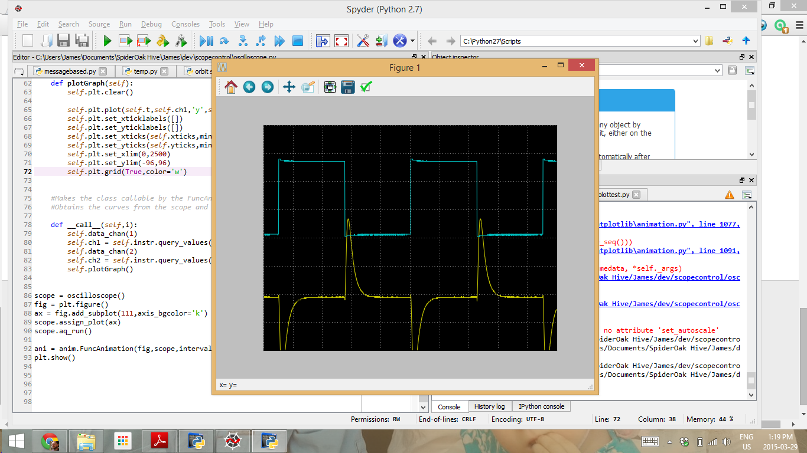

# tektronix-oscilloscope
Allows live capture and display of TBS1022 Digital Storage Oscilloscope.

@author: James Hoyland (posted here with permission and cc0 applied)
Kwanlten Polytechnic University
Physics for Modern Technology

Oscilloscope replicates the standard 2 channel YT display of the Tektronix TBS1022
scope in a live animated plot. Its main purpose was to allow the live display of oscilloscope
traces on a data projector during classroom demonstrations. Update speed is rather slow
in comparison to the scope itself, probably limited by the USB transfer speed.

TODO: incorporate some more UI to allow freezing and saving of data. Save / recall of scope
settings. Display of channel / timebase parameters.

## Screen-shot

## Related Notes Regarding Interacting with TBS1022

Early notes by Dan Peirce related to communication with TBS1022 at
<http://members.shaw.ca/danielpeirce/notes/python.html#controlling-gpib-rs232-and-usb-instruments>

## CC0

  
   
  To the extent possible under law,
  <a rel="dct:publisher"
     href="https://github.com/danpeirce/tektronix-oscilloscope">https://github.com/danpeirce/tektronix-oscilloscope</a>
  has waived all copyright and related or neighboring rights to
  oscilliscope.py.
This work is published from:

  Canada.

